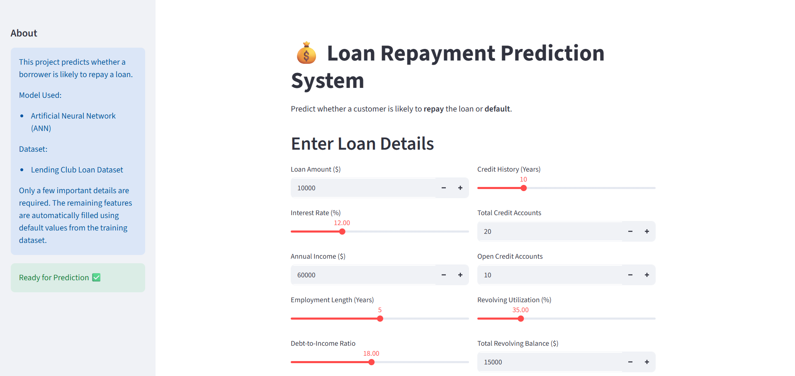
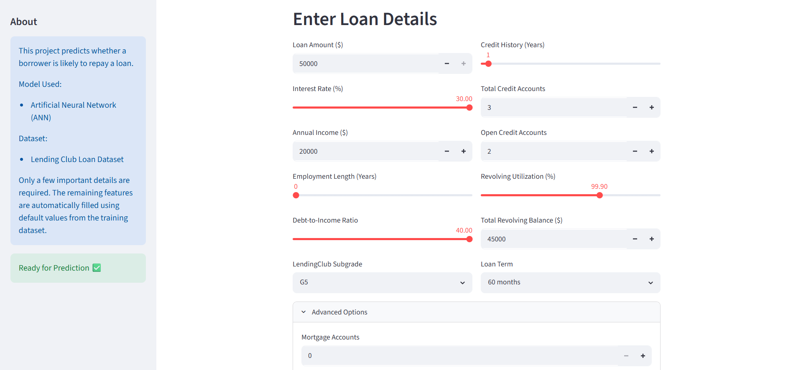
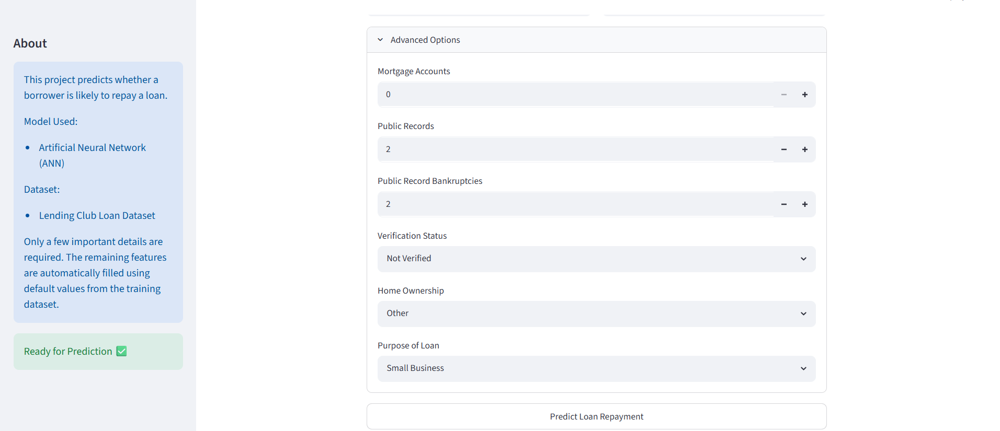
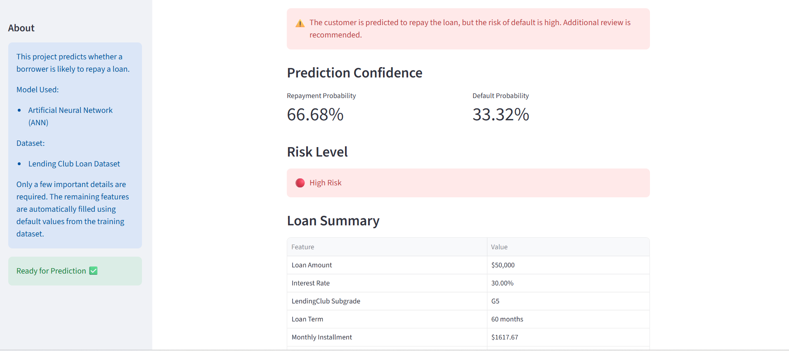

# Loan Repayment Prediction System

A Deep Learning-based loan repayment prediction system built using TensorFlow/Keras and Streamlit.

## Features
- Predicts loan repayment likelihood
- Interactive Streamlit web app
- Deep Learning model
- Risk level and confidence score

## Application Screenshots

### Home Page

### Prediction Result

### Risk Assessment

